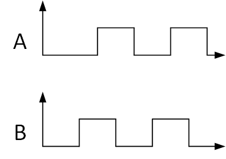
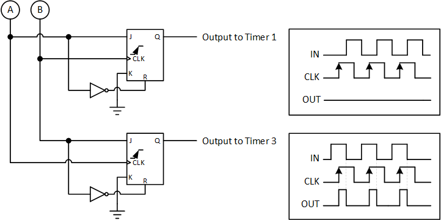
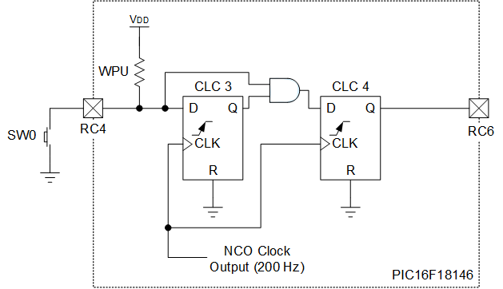
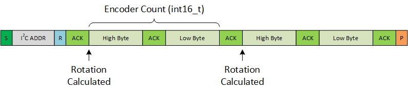

<!-- Please do not change this logo with link -->

# User Interface Co-Processor with PIC16F18146

This example uses the PIC16F18146 to act as a user-interface co-processor, where the MCU debounces a pushbutton, performs quadrature decoding, and generates 4 programmable PWM channels. As the functionality of this example is developed in software, it can be customized to the design.

## Related Documentation

- [Advanced I2C 8-Bit I/O Expander with PIC16F15244 Family](https://github.com/microchip-pic-avr-examples/pic16f15244-family-advanced-i2c-io-expander)
- [Quadrature Decoder with PIC18F16Q40](https://github.com/microchip-pic-avr-examples/pic18f16q40-quadrature-decoder)

## Software Used

- [MPLAB® X IDE v6.0.5 or newer](https://www.microchip.com/en-us/tools-resources/develop/mplab-x-ide?utm_source=GitHub&utm_medium=TextLink&utm_campaign=MCU8_MMTCha_pic171xx&utm_content=pic16f18146-quad-decoder-mplab-mcc-github)
- [MPLAB® XC8 v2.40.0 or newer](https://www.microchip.com/en-us/tools-resources/develop/mplab-xc-compilers?utm_source=GitHub&utm_medium=TextLink&utm_campaign=MCU8_MMTCha_pic171xx&utm_content=pic16f18146-quad-decoder-mplab-mcc-github)
- [MPLAB Code Configurator (MCC)](https://www.microchip.com/en-us/tools-resources/configure/mplab-code-configurator?utm_source=GitHub&utm_medium=TextLink&utm_campaign=MCU8_MMTCha_pic171xx&utm_content=pic16f18146-quad-decoder-mplab-mcc-github)
- PIC16F1xxxx_DFP v1.15.191

## Hardware Used

- [Curiosity LPC (DM164137)](https://www.microchip.com/en-us/development-tool/DM164137?utm_source=GitHub&utm_medium=TextLink&utm_campaign=MCU8_MMTCha_pic171xx&utm_content=pic16f18146-quad-decoder-mplab-mcc-github)
- [PIC16F18146 DIP](https://www.microchip.com/en-us/product/PIC16F18146?utm_source=GitHub&utm_medium=TextLink&utm_campaign=MCU8_MMTCha_pic171xx&utm_content=pic16f18146-quad-decoder-mplab-mcc-github)
- [MCP2221A Breakout Module (ADM00559)](https://www.microchip.com/en-us/development-tool/ADM00559?utm_source=GitHub&utm_medium=TextLink&utm_campaign=MCU8_MMTCha_pic171xx&utm_content=pic16f18146-quad-decoder-mplab-mcc-github)
    - For testing
- Rotary Encoder with Quadrature Output
    - PEC12R-4215F-N0024 was used, but other encoders are also compatiable
- Wire

## Setup

With the power off, install the PIC16F18146 into the socket of the Curiosity LPC board, while matching the pin 1 marker on the DIP and PCB. Connect the MCP2221A breakout to the board as follows.

| IO Pin | Description
| ------ | ---------
| RB4 | SCL, I2C Clock Line
| RB6  | SDA, I2C Data Line
| GND | Connect the ground of the MCP2221A to the LPC board.

*Important: Match the voltage of the MCP2221A breakout to the setting on the Curiosity LPC. Either +5V or 3.3V can be used, depending on the circuit requirements. Do NOT connect power from the MCP2221A to the LPC.*

Next, follow the application circuit of the encoder (if provided), and connect the encoder as follows.

| IO Pin | Description
| ------ | ----------
| RC0 | Quadrature Decoder "A" Input
| RC1 | Quadrature Decoder "B" Input
| VDD | Power supply for the MCU
| GND | Connect the ground of the circuit to the LPC board.

*Note: The "A" and "B" inputs can be flipped for reverse direction. For instance, if clockwise adds to the count, then flipping the inputs will subtract from it.*

### Built-In (Pre-wired) Features

For the pushbutton, the button built-in to the LPC is used (S1). No wiring is required. Pin RC6 is the debounced output, which is viewable on an oscilloscope. 

| IO Pin | Description
| ------ | ----------
| RC4 | Pushbutton Input (S1)
| RC6 | Debounced Output (*Optional, Connect to oscilloscope with ground for testing*)

*Note: It was difficult to generate any bounces from S1. Bounces can be easily generated by connecting a piece of wire to RC4 and tapping it on a grounded pin or connection.*

To demonstrate the PWM controls, the LEDs on the LPC are connected to the outputs of the PWM peripherals. The table below shows the connections. 

| IO Pin | Description
| ------ | ----------
| RC5 | PWM_CH1 (PWM1, Phase 1)
| RA2 | PWM_CH2 (PWM1, Phase 2)
| RA1 | PWM_CH3 (PWM2, Phase 1)
| RA5 | PWM_CH4 (PWM2, Phase 2)

### Summary of I/O Usage

| IO Pin | Description
| ------ | ----------
| RB4 | SCL, I2C Clock Line
| RB6  | SDA, I2C Data Line
| RC0 | Quadrature Decoder "A" Input
| RC1 | Quadrature Decoder "B" Input
| RC4 | Pushbutton Input (S1)
| RC6 | Debounced Output (*Optional, Connect to oscilloscope with ground for testing*)
| RC5 | PWM_CH1 (PWM1, Phase 1)
| RA2 | PWM_CH2 (PWM1, Phase 2)
| RA1 | PWM_CH3 (PWM2, Phase 1)
| RA5 | PWM_CH4 (PWM2, Phase 2)  

## Theory of Operation

This application implements a simple user-interface co-processor for an embedded system. By doing this, the more powerful main processor can spend less time on minor tasks, which can improve performance or save power.

This proof-of-concept project implements 3 key functions for the main processor:
 - Decoding quadrature signals from rotary encoders
 - Generating 4 PWM waveforms
 - Debouncing a pushbutton

As this application is software defined, the exact functionality can be customized to meet the requirements of the system.

### Decoding Quadrature Signals

Quadrature encoded signals are commonly generated from rotary encoders, which are often used as knobs on user interfaces. The quadrature encoded signal is composed of 2 square waves 90 degrees out of phase. 1 of the squares waves will lead while the other lags. 

  

Depending on which of the waveforms is leading, this is interpreted as rotation in the clockwise or counter-clockwise direction. If inputs "A" and "B" are flipped, the direction is flipped, but this does not impact the decoder performance.

To implement the quadrature decoder, 2 Configurable Logic Cells (CLC) are used to process the waveforms into *Clockwise* or *Counter-Clockwise* pulses. Each of these pulses is used to clock a timer (TMR1 or TMR3), which increments by 1 each time a pulse is counted.

  

To determine the net rotation, the program reads the pulse count from each timer, calculates the change since the last read, then subtracts the change in TMR1 from TMR3. This calculates the net direction of movement. 

### Generating 4 PWMs

PWM dimming is commonly used with LEDs to vary the intensity of light. This can be used to generate various lighting effects. 

The PWM waveforms are generated by Core Independent Peripherals (CIP), which operate independently of the CPU, excluding setup and reconfiguration. Each CIP can generate 2 outputs at the same frequency, but independent duty cycles. 

### Debouncing a Button

Pushbuttons and switches exhibit a temporary "bounce" when pressed or released. These bounces create brief periods of instability that would confuse the system if not filtered out. 

In this example, a hardware-level button debouncer is implemented using hardware peripherals. To implement this functionality, 2 CLCs and the Numerically Controlled Oscillator (NCO) CIPs are used. The NCO generates a low-frequency clock (200 Hz) for the CLCs, while the CLCs perform basic digital filtering, as shown below.

*Note: For extending this project with additional buttons, software debouncing may be necessary.*

## Operation

### I2C Interface

To communicate with the device, I2C is used. This device is setup as an I2C client with an address of 0x40. (The address can be changed in software).

 When I2C is not active, the device is in sleep to save power. 

#### Writing Data

To configure the device, perform an I2C write to the device. Writes take the form as:

Where each byte written increments the address by 1. 

This application implements "virtual registers" which are addresses for specific functionality that is implemented in software, rather than hardware, like a standard ASIC. As a result, the virtual registers can be rearranged and modified freely.

A list of the virtual registers is shown below.

| Register Name | Address | Data Width (bytes) | Description
| ------------- | ------- | ----- | ------------
| QUAD_DECODE_PWM_CH12_PR | 0x00 | 2 | Sets the Period of PWM 1 (CH1 and CH2) 
| QUAD_DECODE_PWM_CH34_PR | 0x01 | 2 | Sets the Period of PWM 2 (CH3 and CH4) 
| QUAD_DECODE_PWM_CH1_DC | 0x02 | 2 | Sets the Duty Cycle of PWM 1, Phase 1 (CH1)
| QUAD_DECODE_PWM_CH2_DC | 0x03 | 2 | Sets the Duty Cycle of PWM 1, Phase 2 (CH2)
| QUAD_DECODE_PWM_CH3_DC | 0x04 | 2 | Sets the Duty Cycle of PWM 2, Phase 1 (CH1)
| QUAD_DECODE_PWM_CH4_DC | 0x05 | 2 | Sets the Duty Cycle of PWM 2, Phase 2 (CH2)
| QUAD_DECODE_IO_CONFIG | 0x06 | 1 | Configures the I/O according to the bitmap. (See I/O Configuration Section)
| QUAD_DECODE_EEPROM_SAVE | 0x07 | 2 | Saves the current settings to EEPROM. EEPROM settings are loaded on startup. The bytes sent with this command must match EEPROM unlock sequence.

#### Reading Data

To get the net change from the quadrature decider, perform an I2C read. The bytes read from the device are in int16_t format, with the 1st byte being the high byte, and the 2nd byte being the low byte. An example is shown below, with 2 back-to-back reads:

*Note: The application automatically zeros the net change after each read.*

When the high-byte is read, the microcontroller computes the net rotation. This ensures the value doesn't rollover while a read is happening. After the low-byte, the system will repeat the operation above, but with the net rotation since the last read. 

*Note: Very long byte read sequences with the MCP2221A seem to fail, likely due to insufficent clock stretching time for the client. Be sure to give the device time to respond.*

#### Setting Up PWM

For each channel of PWM, there is an associated period and duty cycle register. These settings can be set independently of each other, or at the same time. The PWM is internally loaded and started at the same time to keep the channels as synchronized as possible.

**Note: Setting the channels to differing frequencies is likely to break synchronization.**

Consult the PWM chapter of the datasheet for more information about the PWM.

##### Frequency Setup

The PWM Core Independent Peripheral (CIP) generate 2 outputs for each instance of the peripheral. These instances share the same frequency, but different duty cycles. The period register determines the max count in the PWM timer. For instance, setting a period of 10, would limit the count to 10 or less. Each time the clock source (LFINTOSC, 31 kHz) goes high, the counter increments.

To determine the value to write for a given frequency, divide the clock source frequency by the desired target. As an example, if the desired output was 100 Hz, then write 310 (0x01, 0x36) to the register. 

##### Duty Cycle Setup

The PWM CIP compares it's internal count with the value set in the register. This example operates in left-aligned mode, which means the PWM goes HIGH immediately and goes LOW when the count matches the set value.

To determine the value, multiple the period by the duty cycle (expressed as a decimal). Continuing the example from *Frequency Setup* (period of 310), a duty cycle of 20% is desired. Multiplying the period and the duty cycle yields a value of 62 (0x00, 0x3E). 

#### Configuring I/O

Device I/O is used to either enable or disable internal pull-up resistors for inputs or to switch between push-pull and open-drain outputs. The defaults for each input and output are set at compile time in MCC. On startup, the I/O is reconfigured according to the settings stored in EEPROM, which allows for customization of the I/O.

#### Saving Settings

To save settings into EEPROM, the unlock sequence (default: 0xAA, 0x55) must be written. Any additional data written after this will cancel the EEPROM save.

## Summary
This example has shown a proof-of-concept of a User-Interface processor. Since the functionality is defined by software, it can be customized to fit the design requirements. 